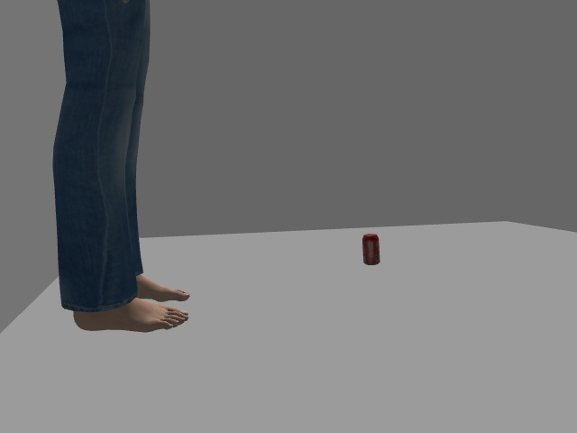
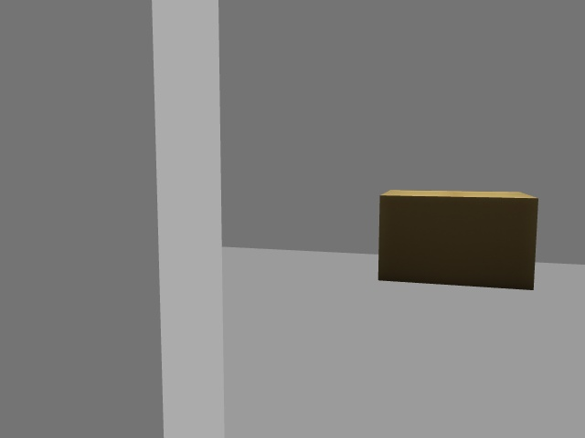
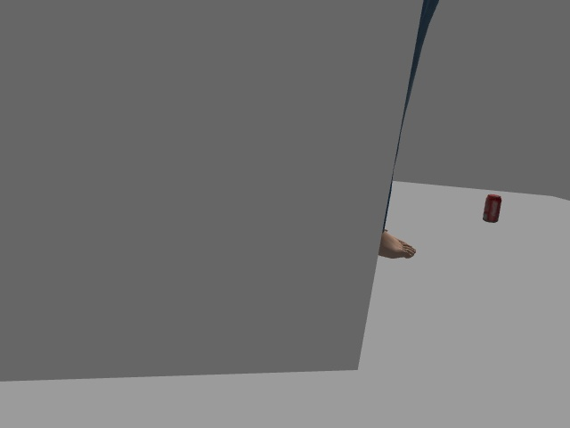
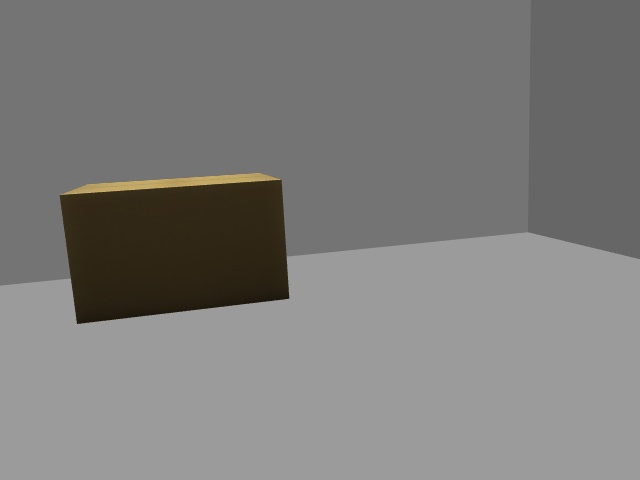

# GO2 Nav2 + YOLOv8 — Unitree Gazebo Demo

A Gazebo Classic simulation of the **Unitree GO2 quadruped** using a **person detector**
and **Nav2** to autonomously navigate toward a target — running the full CHAMP legged
locomotion stack.


> **Related:** This demo isolates the Nav2 + detection pipeline from my
> [GO2 Seeing-Eye Dog](https://github.com/yusufdxb/GO2-seeing-eye-dog) thesis project.

> **Results:** YOLOv8n — 53 ms / 18.8 fps on CPU. YOLOv8s — 117 ms / 8.6 fps on CPU.
> Full benchmark data and Nav2 parameter rationale: [RESULTS.md](RESULTS.md)

---

## What Works Now

- ✅ GO2 spawns and walks in Gazebo Classic (CHAMP quadruped gait controller)
- ✅ SLAM Toolbox builds a 2D occupancy map from LiDAR scans
- ✅ Nav2 plans and executes paths to goal poses (Regulated Pure Pursuit controller)
- ✅ Person detection → Nav2 goal → robot walks to ~0.8 m standoff in front of person
- ✅ YOLOv8n: 53 ms mean inference latency, 18.8 fps on CPU — real-time capable on GO2 hardware
- ✅ All DDS/TF/SLAM startup race conditions documented and fixed (see [Key Design Decisions](#key-design-decisions--bug-fixes))
- ✅ Real-hardware `detector_node` (YOLOv8n + RealSense depth fusion) included alongside the sim path

> Benchmark data and Nav2 parameter justifications: [RESULTS.md](RESULTS.md)

---

## Demo

The GO2 quadruped spawns in a Gazebo world with detection targets. The detection
pipeline publishes positions and the robot autonomously navigates toward them.

### GO2 Camera View — Training Data Samples

| Person + Coke Can | Cardboard Box | Person (side) | Box (close) |
|:-:|:-:|:-:|:-:|
|  |  |  |  |

*Frames captured from the GO2's onboard RGB camera while autonomously driving around objects in the Gazebo demo world.*

---

## What It Does

```
Sim detector ──► person position (map frame) ──► navigator_node
                                                        │
                                                        ▼
                                               Nav2 NavigateToPose
                                                        │
                                                        ▼
                                           CHAMP quadruped controller
                                                        │
                                                        ▼
                                           GO2 walks to the person
```

1. GO2 spawns in a Gazebo world with detection targets: `person_standing` at `(2,0,0)`, `construction_cone` at `(1.5,1.5,0)`, `coke_can` at `(2.5,-1,0)`, `cardboard_box` at `(0,2,0)`
2. `sim_person_detector` publishes the person's map-frame position at 2 Hz
3. `navigator_node` receives detections, computes a goal 0.8 m in front of the person, and sends a Nav2 `NavigateToPose` action
4. Nav2 (SLAM Toolbox + Regulated Pure Pursuit) plans a path and publishes `/cmd_vel`
5. CHAMP translates `/cmd_vel` into quadruped gait — the GO2 walks there

> **Note on YOLO:** Pretrained YOLOv8n struggles with Gazebo's synthetic rendering.
> The `sim_person_detector` node bypasses YOLO by publishing known model positions
> directly. A custom training pipeline (see [Training Pipeline](#custom-yolo-training-pipeline))
> is included to fine-tune YOLOv8 on simulation data. Use `detector_node` for real hardware.

---

## Architecture

```
┌────────────────────────────────────────────────────────┐
│                    Gazebo Classic                       │
│  GO2 URDF  |  Hokuyo LiDAR  |  RGB-D Camera  |  IMU   │
└────────────────────────────────────────────────────────┘
     │ /scan   │ /go2/camera/*   │ /joint_states   │ /imu
     ▼
┌──────────────────────────────┐
│  scan_relay node             │  filters stale scans (FastDDS
│  /scan → /scan_slam          │  history replay bug), forwards
└──────────────────────────────┘  to SLAM with correct timestamps
     │ /scan_slam
     ▼
┌───────────────────────────────────────────────────────┐
│  Nav2 Stack                                           │
│  SLAM Toolbox  |  Regulated Pure Pursuit  |  BT Nav  │
└───────────────────────────────────────────────────────┘
     ▲ NavigateToPose action
     │
┌──────────────────────────────┐
│  navigator_node              │◄── /detected_objects
│  computes goal pose          │
└──────────────────────────────┘
     ▲
┌──────────────────────────────┐
│  sim_person_detector         │  publishes person at (2,0,0)
│  (or detector_node for HW)   │  in map frame @ 2 Hz
└──────────────────────────────┘
     │ /cmd_vel
     ▼
┌──────────────────────────────┐
│  CHAMP Controller            │  quadruped gait + EKF odometry
└──────────────────────────────┘
```

---

## Package Structure

```
ros2-go2-nav2-yolo/
├── go2_sim_env.sh                    # ★ Source this before every launch
├── go2_description/                  # GO2 URDF, meshes, ros2_control config
│   ├── xacro/
│   │   ├── go2_robot.xacro           # Main robot description
│   │   ├── camera.xacro              # RGB-D camera plugin (depth enabled)
│   │   ├── hokuyo_utm30lx.urdf.xacro # LiDAR with explicit frame_id fix
│   │   └── ...
│   └── config/
│       └── go2_ros_control.yaml
├── go2_yolo_bringup/                 # Launch files + config
│   ├── launch/
│   │   ├── gazebo_launch.py          # Gazebo + GO2 + CHAMP
│   │   ├── navigation_launch.py      # Nav2 + SLAM + scan_relay
│   │   └── yolo_nav_launch.py        # Detector + navigator
│   ├── worlds/
│   │   └── demo_world.world          # World with person_standing at (2,0,0)
│   ├── config/
│   │   ├── nav2_params.yaml          # Nav2 tuned for GO2 (RPP controller)
│   │   └── slam_params.yaml          # SLAM Toolbox settings
│   └── scripts/
│       └── scan_relay.py             # FastDDS history flood fix
├── go2_yolo_detector/                # Detection nodes
│   ├── go2_yolo_detector/
│   │   ├── detector_node.py          # Real hardware: YOLOv8 + depth fusion
│   │   └── sim_person_detector.py    # Simulation: timer-based position publisher
│   └── scripts/
│       ├── detector_node             # Wrapper script (required for ros2 launch)
│       └── sim_person_detector       # Wrapper script (required for ros2 launch)
├── go2_yolo_navigator/               # Nav2 goal publisher
│   └── go2_yolo_navigator/
│       └── navigator_node.py
├── go2_yolo_msgs/                    # Custom messages
│   └── msg/
│       ├── DetectedObject.msg
│       └── DetectedObjectArray.msg
├── training/                         # YOLO training pipeline
│   ├── record_session.py             # Drive + record training data
│   ├── collect_frames.py             # Extract frames from rosbags
│   ├── augment_dataset.py            # Offline data augmentation
│   ├── train.sh                      # Training orchestrator
│   └── export_model.sh               # Export to TorchScript/ONNX
└── docs/
    └── images/                       # Camera samples for README
```

---

## Dependencies

### External packages (clone alongside this repo)

```bash
git clone https://github.com/chvmp/champ.git
git clone https://github.com/chvmp/champ_teleop.git
```

### APT packages

```bash
sudo apt install \
  ros-humble-nav2-bringup \
  ros-humble-navigation2 \
  ros-humble-slam-toolbox \
  ros-humble-robot-localization \
  ros-humble-ros2-control \
  ros-humble-ros2-controllers \
  ros-humble-gazebo-ros2-control \
  ros-humble-gazebo-ros-pkgs \
  ros-humble-xacro \
  ros-humble-joint-state-publisher \
  ros-humble-tf2-ros \
  ros-humble-tf2-geometry-msgs \
  ros-humble-nav2-rviz-plugins
```

### Python packages

```bash
pip install ultralytics opencv-python numpy    # detection + inference
pip install rosbags albumentations             # training pipeline (optional)
```

---

## Setup

```bash
# 1. Create workspace
mkdir -p ~/go2_yolo_ws/src && cd ~/go2_yolo_ws/src

# 2. Clone this repo and dependencies
git clone https://github.com/yusufdxb/ros2-go2-nav2-yolo.git
git clone https://github.com/chvmp/champ.git
git clone https://github.com/chvmp/champ_teleop.git

# 3. Install ROS dependencies
cd ~/go2_yolo_ws
rosdep install --from-paths src --ignore-src -r -y

# 4. Build
colcon build --symlink-install

# 5. Copy the sim environment script to your home directory
cp src/ros2-go2-nav2-yolo/go2_sim_env.sh ~/go2_sim_env.sh
chmod +x ~/go2_sim_env.sh
```

---

## Run

> **Always source `go2_sim_env.sh` instead of the plain ROS setup.** It sets the
> software rendering env vars required to prevent Gazebo crashes on machines without
> a dedicated GPU.

### Launch sequence (3 terminals)

```bash
# Kill any leftover processes first
pkill -f gzserver; pkill -f gzclient; pkill -f ros2; sleep 3

# T1 — Gazebo + GO2 + CHAMP controller
source ~/go2_sim_env.sh && ros2 launch go2_yolo_bringup gazebo_launch.py
# Wait ~30s for robot to spawn and start walking

# T2 — Nav2 + SLAM Toolbox + RViz
source ~/go2_sim_env.sh && ros2 launch go2_yolo_bringup navigation_launch.py
# Wait ~30s for SLAM to build initial map (watch for map frame in RViz)

# T3 — Sim detector + navigator (navigates to person automatically)
source ~/go2_sim_env.sh && ros2 launch go2_yolo_bringup yolo_nav_launch.py target_class:=person
```

### Verify detections are publishing

```bash
source ~/go2_sim_env.sh && ros2 topic echo /detected_objects
```

### Send a manual Nav2 goal (CLI)

```bash
ros2 action send_goal /navigate_to_pose nav2_msgs/action/NavigateToPose \
  "{pose: {header: {frame_id: map}, pose: {position: {x: 1.5, y: 0.0, z: 0.0}, orientation: {w: 1.0}}}}"
```

### RViz Nav2 goal tool

Use the **5th toolbar button** (`nav2_rviz_plugins/GoalTool`) — the target/arrow icon.
**Not** the "2D Goal Pose" button — that sends to `/goal_pose` which `bt_navigator` ignores.

### Teleop (to build map before navigating)

```bash
source ~/go2_sim_env.sh && ros2 run teleop_twist_keyboard teleop_twist_keyboard
```

### If ros2 CLI commands crash with `xmlrpc.client.Fault`

The ROS2 daemon is stale. Fix:

```bash
ros2 daemon stop && ros2 daemon start
```

---

## Key Design Decisions & Bug Fixes

Everything that needed fixing from the upstream GO2+Nav2 base. Useful if you're
building something similar.

### 1. Rendering — `go2_sim_env.sh`

For **hardware GPU** (NVIDIA), only two env vars are needed:

```bash
export LIBGL_DRI3_DISABLE=1       # required for depth camera OGRE sensor init
export OGRE_RTT_MODE=Copy         # prevents OGRE render-to-texture crash
```

For **software rendering** (no GPU / Mesa / llvmpipe), also add:

```bash
export LIBGL_ALWAYS_SOFTWARE=1    # force software rendering
```

`gzserver` must be launched via `ExecuteProcess` with `additional_env` — not
`SetEnvironmentVariable` + `IncludeLaunchDescription`, which does **not** reliably
propagate env vars to child processes.

### 2. FastDDS history replay / scan TF drops

**Problem:** FastDDS replays its RELIABLE writer history to new readers. SLAM starts
after the robot, so it receives a flood of old scan messages with timestamps before
its TF buffer exists — drops them all with `"timestamp earlier than all data in
transform cache"`.

**Fix:** `scan_relay.py` subscribes to `/scan` with BEST_EFFORT QoS (bypasses history
replay), filters scans older than 1 s, and republishes to `/scan_slam`. Both SLAM and
the Nav2 costmaps use `/scan_slam`.

### 3. SLAM startup TF race

`navigation_launch.py` delays SLAM Toolbox 10 s via `TimerAction`. This ensures the
TF chain (`odom → base_footprint`) from CHAMP is established before SLAM processes
its first scan.

Key `slam_params.yaml` settings:

```yaml
base_frame: base_footprint   # matches CHAMP's published frame (not base_link)
scan_topic: /scan_slam        # use relayed topic
transform_timeout: 0.0        # prevents SLAM executor deadlock
tf_buffer_duration: 60.0
map_update_interval: 1.0
```

### 4. LiDAR frame ID

The Hokuyo plugin must have an explicit `<frame_name>` in the URDF xacro, otherwise
it defaults to `base_link` and SLAM receives the wrong transform chain:

```xml
<frame_name>${name}_frame</frame_name>
```

### 5. Nav2 controller — DWB → RegulatedPurePursuit

DWB was unstable with the GO2's quadruped motion model. Switched to
`RegulatedPurePursuitController` with `use_rotate_to_heading: false` to prevent
spinning in place before every move.

### 6. CycloneDDS crash

Using `CYCLONEDDS_URI` with loopback-only settings crashes on local simulation.
`go2_sim_env.sh` unsets both `CYCLONEDDS_URI` and `RMW_IMPLEMENTATION` and uses
FastDDS (the default).

### 7. YOLO detection in simulation

YOLOv8n cannot detect the `person_standing` Gazebo model — software rendering
produces images too synthetic (wrong textures, lighting). Two detection modes:

| Mode | Node | Use case |
|------|------|----------|
| `sim_person_detector` | Publishes hardcoded position at (2,0,0) in map frame | Simulation |
| `detector_node` | YOLOv8n + depth image fusion | Real hardware |

`sim_person_detector` uses a timer (2 Hz) — no `/gazebo/model_states` dependency
(the `gazebo_ros_state` plugin was unreliable at runtime).

### 8. Camera depth scale

Gazebo publishes depth images as `32FC1` in **metres**. The original `detector_node.py`
divided by 1000 (treating depth as millimetres). Fixed.

### 9. Navigator goal cooldown

`navigator_node` enforces a 5 s minimum between Nav2 goal sends. Without this,
2 Hz detections cause rapid goal preemptions that overload the BT navigator and
cause erratic robot motion.

### 10. Executable wrapper scripts

ROS2 launch finds executables in `lib/<package>/`. Python `console_scripts` installs
to `bin/` — the launch system won't find them. Fix: add a shell wrapper script to
`scripts/` and include it in `data_files` in `setup.py`:

```python
data_files=[
    ('lib/' + package_name, ['scripts/detector_node', 'scripts/sim_person_detector']),
],
```

---

## RViz Tips

- Set **Fixed Frame** to `odom` first, then switch to `map` once SLAM builds the map
- Map updates lag ~1 s — normal with `map_update_interval: 1.0`
- If the map frame doesn't appear within 30 s of launching T2, teleop the robot to
  trigger scan processing

---

## Known Issues

- **Scan TF drops:** Persistent `"hokuyo_frame earlier than all data in transform cache"` warnings. Navigation works despite occasional drops.
- **Odometry drift:** CHAMP state estimation drifts over long distances. Fine for short demos.
- **Robot gets stuck:** If the robot wanders far before T3 launches, the SLAM costmap may have phantom obstacles blocking the path. Kill everything and restart for a clean map.
- **Slow startup:** SLAM needs 20-30 s to initialize. The `map` frame will not exist in RViz until the first scan is processed successfully.

---

## Custom YOLO Training Pipeline

The repo includes a pipeline for collecting and training on simulation data. See
[YOLO_TRAINING_PLAN.md](YOLO_TRAINING_PLAN.md) for the full strategy.

### Collect training data

```bash
# 1. Launch the simulation (Terminal 1)
source go2_sim_env.sh && ros2 launch go2_yolo_bringup gazebo_launch.py

# 2. Drive the robot around objects while recording (Terminal 2)
source go2_sim_env.sh && python3 training/record_session.py
# Records camera, depth, odom, TF to ~/datasets/raw_bags/session_YYYYMMDD_HHMM/

# 3. Extract frames at 3 fps
python3 training/collect_frames.py extract \
    --bag ~/datasets/raw_bags/session_YYYYMMDD_HHMM \
    --out ~/datasets/raw_frames/session_YYYYMMDD_HHMM \
    --fps 3

# 4. Label frames (Label Studio / Roboflow), then split
python3 training/collect_frames.py split \
    --frames ~/datasets/raw_frames/session_YYYYMMDD_HHMM \
    --dataset ~/datasets/go2_perception

# 5. Train
bash training/train.sh --data ~/datasets/go2_perception/data.yaml --epochs 50
```

### Training scripts

| Script | Purpose |
|--------|---------|
| `training/record_session.py` | Drives GO2 around world objects while recording rosbag |
| `training/collect_frames.py` | Extracts frames from bags, splits into train/val/test |
| `training/augment_dataset.py` | Offline augmentation (albumentations) |
| `training/auto_label.py` | Auto-labeler using Gazebo model states (in development) |
| `training/train.sh` | YOLOv8 training orchestrator |
| `training/export_model.sh` | Export to TorchScript/ONNX |

---

## Credits

- [arjun-sadananda/go2_nav2_ros2](https://github.com/arjun-sadananda/go2_nav2_ros2) — GO2 + Nav2 Gazebo base
- [chvmp/champ](https://github.com/chvmp/champ) — CHAMP quadruped controller
- [unitreerobotics/unitree_ros](https://github.com/unitreerobotics/unitree_ros) — GO2 URDF/meshes

---

## Author

**Yusuf Guenena** | M.S. Robotics Engineering, Wayne State University
[LinkedIn](https://www.linkedin.com/in/yusuf-guenena) · [GitHub](https://github.com/yusufdxb)
