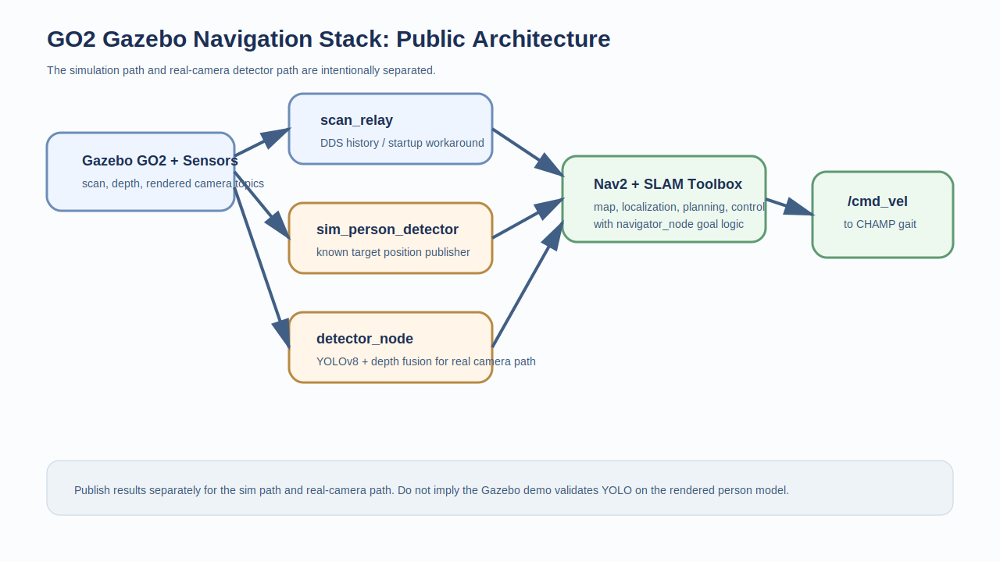

# GO2 Navigation Stack in Gazebo

> Unitree GO2 simulation stack integrating Gazebo, CHAMP, SLAM Toolbox, Nav2, and a perception-to-navigation pipeline.

**What this repo demonstrates well:** robotics systems integration and debugging  
**What it does not demonstrate honestly in simulation:** end-to-end YOLO perception on the rendered Gazebo person model


> Related project: this repo isolates a navigation/perception integration path from the broader [GO2 Seeing-Eye Dog](https://github.com/yusufdxb/GO2-seeing-eye-dog) thesis work.

## What The Repo Actually Shows

This repository is strongest as a public engineering artifact for integrating and debugging a GO2 autonomy stack in simulation.

Implemented in the public tree:
- GO2 description and simulation assets
- CHAMP-based locomotion integration
- Nav2 + SLAM Toolbox bringup
- custom detector and navigator packages
- scan relay for DDS history issues
- real-hardware detector path using YOLOv8 + depth fusion
- simulation detector path using known target position publishing

## Important Honesty Note

The repository includes a YOLO-based detector for real camera input, but the default simulation demo does **not** rely on YOLO detecting the Gazebo `person_standing` model. In Gazebo Classic with software rendering, that model was too synthetic for reliable YOLOv8 detection, so the sim demo uses `sim_person_detector` to publish the target position directly.

That does not make the repo weak. It just means the repo should be framed as:
- a strong autonomy-stack integration project
- a strong debugging/documentation project
- not a misleading claim that simulated YOLO perception worked end to end when it did not

## Public Architecture



Topic graph captured from the workspace: [frames_2026-03-17_04.00.57.pdf](frames_2026-03-17_04.00.57.pdf)

## What Makes This Repo Strong

This is one of the stronger public repos in the portfolio because it documents real integration work:
- Gazebo software-rendering stability fixes
- FastDDS history replay workaround for SLAM startup
- TF startup timing fixes
- LiDAR frame configuration fixes
- Nav2 controller tuning from DWB to Regulated Pure Pursuit
- executable wrapper setup for ROS 2 launch discovery

Those are the kinds of issues autonomy teams actually spend time on.

## Repo Layout

| Path | Purpose |
|---|---|
| `go2_description/` | GO2 URDF, xacro, meshes, ros2_control config |
| `go2_yolo_bringup/` | launch files, Nav2 config, worlds, RViz config, utility scripts |
| `go2_yolo_detector/` | detector code for hardware and sim modes |
| `go2_yolo_navigator/` | goal generation and navigation interface |
| `go2_yolo_msgs/` | custom messages |
| `training/` | dataset collection and model training utilities |
| `docs/RESULTS_TEMPLATE.md` | first benchmark template for honest public reporting |

## Detection Modes

| Mode | Node | Public use |
|---|---|---|
| Simulation target publisher | `sim_person_detector` | Gazebo demo |
| Camera + depth + YOLOv8 | `detector_node` | real hardware path |

## Setup

```bash
mkdir -p ~/go2_yolo_ws/src
cd ~/go2_yolo_ws/src
git clone https://github.com/yusufdxb/ros2-go2-nav2-yolo.git
git clone https://github.com/chvmp/champ.git
git clone https://github.com/chvmp/champ_teleop.git
cd ~/go2_yolo_ws
rosdep install --from-paths src --ignore-src -r -y
colcon build --symlink-install
cp src/ros2-go2-nav2-yolo/go2_sim_env.sh ~/go2_sim_env.sh
chmod +x ~/go2_sim_env.sh
```

## Launch

```bash
source ~/go2_sim_env.sh
ros2 launch go2_yolo_bringup gazebo_launch.py
```

In a second terminal:

```bash
source ~/go2_sim_env.sh
ros2 launch go2_yolo_bringup navigation_launch.py
```

In a third terminal:

```bash
source ~/go2_sim_env.sh
ros2 launch go2_yolo_bringup yolo_nav_launch.py target_class:=person
```

## Results Scaffold

Use [docs/RESULTS_TEMPLATE.md](docs/RESULTS_TEMPLATE.md) to publish:
- navigation success rate
- final goal error
- launch-to-ready startup time
- detector update rate by mode

